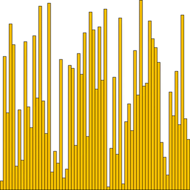
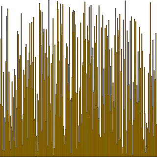
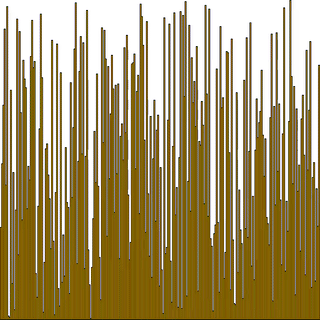
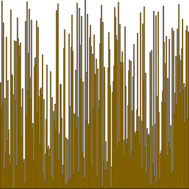
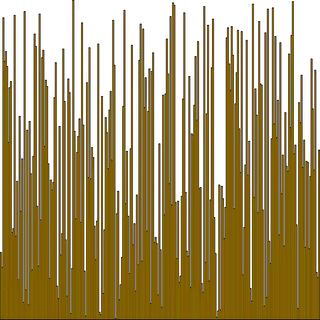
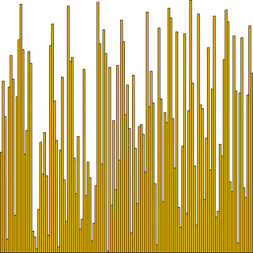
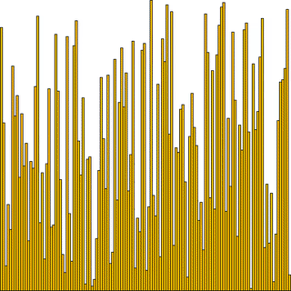
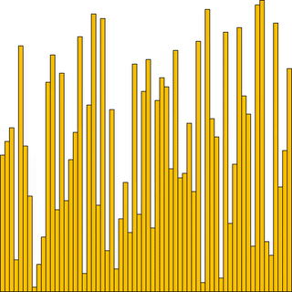
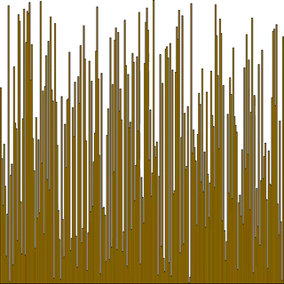

# Sorts Visualization
An app built with Qt to visualize a few dozen implemented sorting algorithms.


```diff
- WARNING
A few memory leaks have recently been discovered and patched.
Both precompiled versions are up to date with the patched source
code, but be aware that some other leaks may still be present.
```

## How to use

#### Compile and execute

After cloning this repository, you can either use the compiled versions provided in `dist/` or choose to recompile. The latter will require Qt for C++.
See `dist/README.md` for compilation information.
The `dist/linux64/` is almost always up to date, but beware that `dist/win32/` is much more rarely so.

Execute either `dist/linux64/Sorts` or `dist/win32/Sorts.exe`, a window should open with a blank drawing zone and a menu on the right.

#### Choose an algorithm

Choose one of the sorting algorithms available using the two-menu selector (see list below for a complete list by category).

The division of algorithms in categories is mostly arbitrary but categories tend to group algorithms that are either:
- variations of each other (e.g. bubblesort/cocktail sort)
- subprocedures of each other (e.g. radix sort/counting sort)
- sharing the same basic approach (e.g. heapsort/smoothsort)
- similar in other ways (e.g. easy to multithread)

Hovering over an algorithm name will display information on the worst-, average-, and best-case performance as well as an indication of the additional memory usage.

#### Choose speed, size, distribution, and scramble

You can then set the speed using the two sliders below. One will set the first digit (0-9) and another the magnitude (1-10-100 ms). Thus the delay can take one of 19 values between 0ms and 900ms.

Only powers of two between 8 and 1024 are supported for the size of the array, in part due to the presence of a few algorithms that would need tweaking to run on arrays of a length that is not a power of 2. Selecting 1024 will automatically expand the window to the size required (i.e. more than 1024 pixels wide).

The 'Distribution' menu allows to choose from:
- one item per value
- random uniform distribution
- normal distribution
- biased towards high/low/extremal values


The scramble method can be chosen using the corresponding menu (random, almost sorted, almost reversed, 1-1 shuffle)

#### Launch sorting

When `Start` is pressed, the app generates a list according to the distribution settings, then shuffles it according to the scramble settings. Sorting begins immediately afterwards.

It is impossible to change settings during sorting. Future versions may allow changing the delay only. `Abort` terminates the running procedure and is not recoverable (implemented with a macro that inserts conditionnal returns in key places of the sorting functions). `Pause` merely calls an infinite loop of interface refresh with a priority higher than the sorting algorithm, thus you should expect no less CPU usage when pausing than when running. (`Abort` however is expected to reduce to (almost) 0 the CPU usage)

Three LCD displays record the number of calls to the compare, read, and write functions.


## List of algorithms by category:

* bubblesort
    * upwards bubblesort
    * downwards bubblesort
    * cocktail shaker
    * comb sort



* quicksort
    * first element as pivot, naive partition
    * middle element as pivot, naive partition
    * median of three, optimized
    * median of medians for optimal pivot



* mergesort
    * mergesort
    * bottom-up mergesort
    * weavesort



* radix sort
    * LSD base 2
    * LSD base 4
    * LSD base 8
    * MSD base 2
    * MSD base 4
    * MSD base 8
    * counting sort



* bucket sort
    * same-length buckets
    * calibrated with random sampler



* insertion sort
    * insertion sort
    * shell sort
    * binary insertion
    * gnome sort



* heapsort
    * max heapsort (2 variants)
    * min heapsort
    * ternary max heapsort
    * smoothsort



* selection sort
    * max select
    * min select
    * double select
    * cycle sort
    * cycle sort with memory of sorted values
    * pancake sort



* networks
    * bitonic sort
    * odd-even mergesort
    both with DFS or BFS sequentialization.
    * shear sort



* suboptimal sorts
    * slowsort
    * stoogesort
    * (less) bogosort
    * random comparisons


The design of the project should make it easy to add more algorithms, please feel free to suggest any.
I am already considering adding recursive bucket sort.

My attempts at adding sound have been unsuccessful as the only sounds I could generate were followed by a click at the end.


_Disclaimer:_
_Even though I included smoothsort, I still don't understand how the code works. That part (and only that part) was copy-pasted straight from Google._
